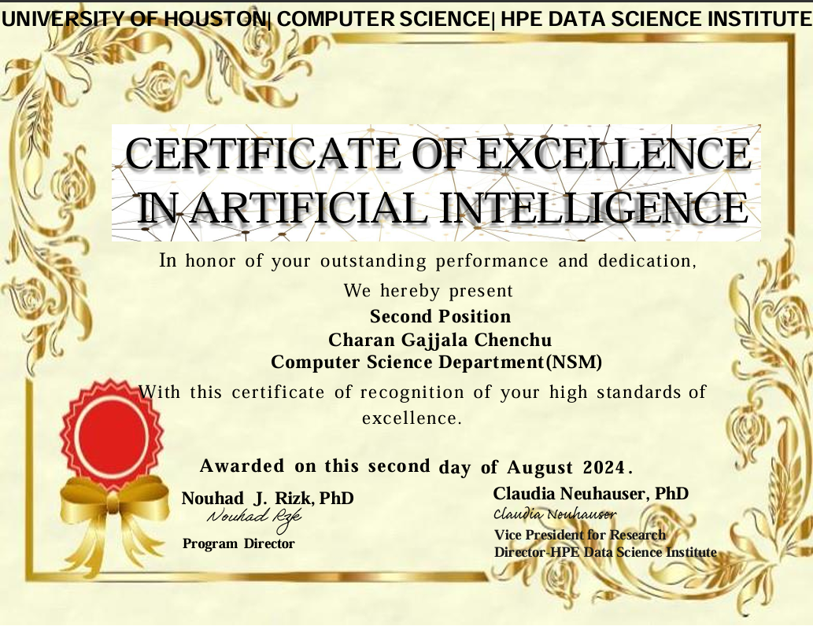
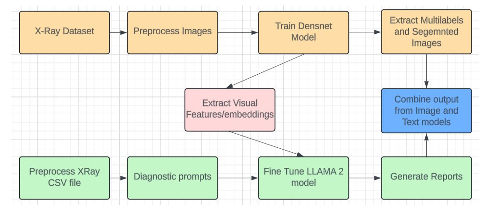

<p align="center"> 
    
</p>

<h1 align="center">MedGen_AI: Multimodal Medical Report Generation 🏥</h1>
<h3 align="center">Generating diagnostic reports from chest X-rays using vision transformers and large language models</h3>

<p align="center">
    <a href="https://pytorch.org/"></a>
    <a href="https://huggingface.co/"></a>
    <a href="https://github.com/TimDettmers/bitsandbytes"></a>
    <a href="https://arxiv.org/abs/2305.14314"></a>
    <a href="https://stanfordmlgroup.github.io/competitions/chexpert/"></a>
</p>

---

# UH Newsletter Recognition

https://uh.edu/nsm/computer-science/news-events/stories/2024/0814-summer-showcase.php

# 🩻 Project Overview
**MedGen_AI** is an advanced multimodal AI system that generates detailed diagnostic reports from chest X-ray images using a fusion of computer vision and large language models. It integrates image understanding with language generation for clinical applications.

---

# 🎯 Problem Statement

- Accurate interpretation of complex radiographic features
- Generation of clinically relevant, multi-sentence reports
- Seamless fusion of visual and textual inputs
- Efficient inference for integration in clinical workflows

---

# 🧠 Model Architecture
<p align="center">
    
</p>


## 🔍 Core Components

- **Vision Encoder**: `DenseNet-121` with attention mechanism
- **Language Model**: `LLaMA-2-7B` fine-tuned using `QLoRA`
- **Fusion Module**: `PreCarDiv` for combining visual and textual embeddings

## 🧱 Visual Pipeline

- Input: X-ray image (224×224 RGB)
- DenseNet-121 outputs: (batch_size, 1024, 7, 7)
- Attention maps for 14 disease categories over 49 patches
- Output: (batch_size, 14, 1024) disease-specific features

## 🗣️ Language Model

- LLaMA-2-7B with QLoRA (rank=8, alpha=8, dropout=0.1)
- 4-bit quantized for memory-efficient training
- Fine-tuned only attention projections (`q_proj`, `k_proj`, etc.)

## 🔄 Multimodal Fusion (PreCarDiv)

- Project vision features to match LLM hidden dim
- Concatenate visual embeddings with token embeddings
- Use causal language modeling for report generation

## 🏋️ Training

- Custom loss masking prompt & visual tokens
- Mixed precision + gradient checkpointing
- BLEU-based evaluation
- Batch size: 1 per GPU
- Learning rate: `5e-4`
- Epochs: 20 with early stopping

---

# 📊 Dataset

- **Name**: CheXpert+ (100 samples)
- **Split**: 60/20/20 train-val-test
- **Features**: X-rays, diagnostic prompts, ground truth reports
- **Labels**: 14 disease categories

---

# 📦 Installation & Setup

### ✅ Requirements

- Python 3.8+
- CUDA-compatible GPU
- 16GB+ RAM recommended

### 🔧 Install Dependencies

```bash
git clone https://github.com/charangajjala/MedGen_AI.git
cd MedGen_AI
pip install -r requirements.txt
```

### 🧠 Set Up Hugging Face Access

- Get token from: https://huggingface.co/settings/tokens
- Add token to notebook when prompted

---

# 🚀 Usage

### 📈 Training

```bash
jupyter notebook multimodal_final.ipynb
```

- Modify configs in Cell 3
- Adjust paths, batch size, epochs
- Run cells to train and validate

### 🔍 Inference

- Load trained model
- Input new X-ray image + prompt
- Generate report using beam search (5 beams)

---

# 🧪 Evaluation

- **Metric**: BLEU score on test reports
- **Parameters Tuned**: QLoRA rank, alpha, dropout
- **Generated Output**: Full radiology reports

---

# ⚙️ Configuration

- **LoRA rank**: 8
- **Dropout**: 0.1
- **Quantization**: 4-bit (nf4), float16 compute
- **Loss**: Masked token-wise cross-entropy

---

# 📚 Documentation

- `PreCarDiv_Dataset.py`: Dataset + Tokenizer + Image Preprocessing
- `Model_PreCarDiv.py`: Fusion model definition
- `CustomTrainer.py`: Handles custom loss and evaluation
- `Precardiv_Poster-G0010.pdf`: Research poster
- `Precardiv ppt-G0010.pdf`: Final presentation


# 🪪 License

This project is licensed under the MIT License - see the [LICENSE](LICENSE) file for details.

---

# 🙏 Acknowledgments

- Hugging Face for LLaMA and Transformers
- Meta AI for LLaMA-2
- Stanford ML Group for CheXpert dataset
- PyTorch & bitsandbytes for optimization tools